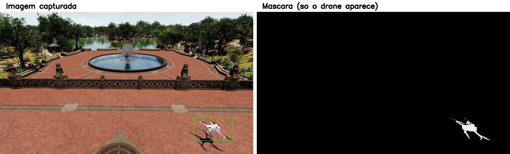
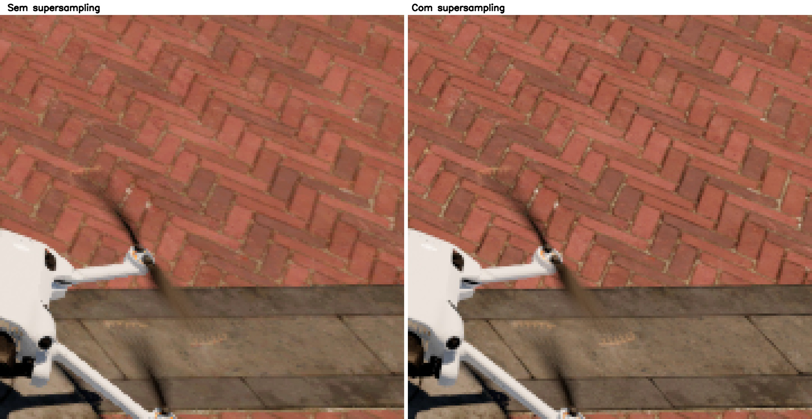
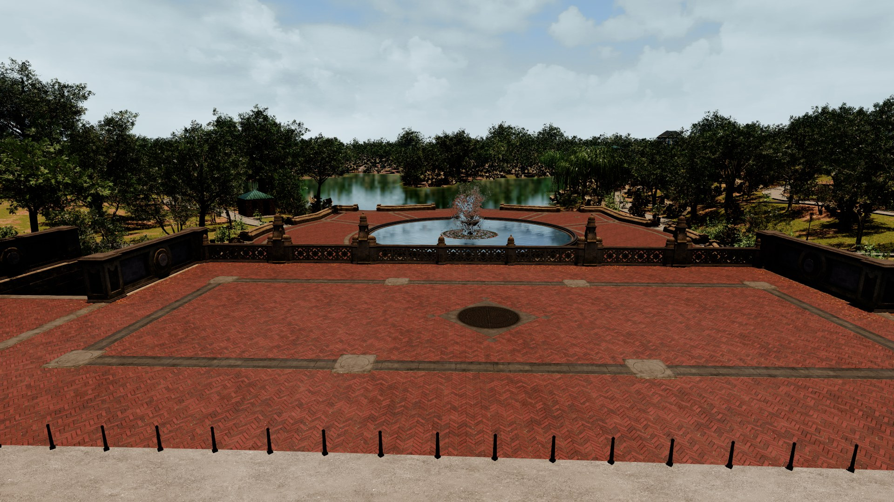
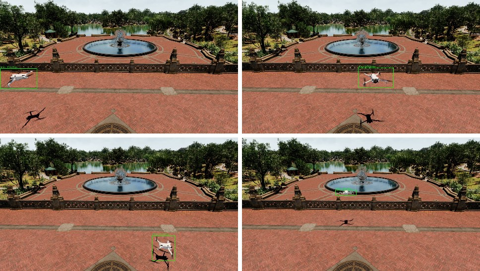

# DroneCapture

Plugin para Unreal Engine 5.5 que gera fotos sintéticas de um drone voando por um mapa, já anotadas no formato que redes de detecção de objetos (YOLO) entendem. Foi feito para um Trabalho de Graduação sobre detecção de drones, mas serve para qualquer projeto que precise desse tipo de dataset.

A ideia é simples: você posiciona algumas câmeras e um volume 3D no mapa, aperta Play, e o plugin move um drone dentro desse volume, tira fotos de cada câmera, descobre onde o drone está em cada imagem e salva tudo pronto para treinar um modelo.

## O que ele resolve

Gerar esse tipo de dataset na mão (fotografar um drone de verdade em centenas de posições e ângulos, depois desenhar a caixa em cada foto) leva muito tempo. O plugin faz isso dentro da Unreal, e alguns dos problemas que apareceram no caminho valem explicar.

### Saber onde o drone realmente está

A parte mais delicada é descobrir onde desenhar a caixa ao redor do drone quando ele está de lado, meio escondido atrás de um poste ou quase saindo do quadro.

A primeira tentativa calculava a caixa a partir da geometria 3D: pegava os cantos do drone e projetava na tela. Funcionava a maior parte do tempo, mas errava justamente nos casos mais realistas, quando alguma coisa bloqueava parte do drone sem que o cálculo soubesse, ou quando o ângulo da câmera fazia a caixa sair bem maior que o drone visível de fato.

A solução que ficou foi outra: em vez de calcular, o plugin captura duas fotos de cada câmera no mesmo instante. Uma é a foto normal. A outra mostra só o drone, em branco sólido, com o resto da cena em preto (essa técnica é chamada de máscara de segmentação). A caixa sai direto dos pixels brancos dessa segunda foto, então ela sempre bate com o que realmente aparece na imagem, e cortes por bordas ou objetos na frente do drone ficam certos automaticamente.



Fazer essa máscara respeitar oclusão de verdade (se tem uma parede na frente do drone, ele precisa mesmo sumir da máscara) deu mais trabalho do que parecia. A engine tem um jeito nativo de marcar um objeto para aparecer sozinho numa passada de renderização separada, mas por padrão esse marcador ignora tudo que não está marcado do mesmo jeito, então o drone continuava aparecendo atrás de paredes e cercas comuns. A correção compara a distância da câmera até o drone com a distância até qualquer outra coisa na frente dele, e só desenha o drone quando ele é realmente o objeto mais próximo naquele ponto da imagem.

### Fotos com menos ruído

Renderizar em tempo real deixa um pouco de granulado na imagem, principalmente em bordas e reflexos. Para reduzir isso, cada foto é tirada numa resolução maior do que o tamanho final e depois reduzida fazendo a média dos pixels vizinhos, a mesma técnica usada em anti-aliasing de jogos. O resultado é uma imagem final mais limpa, sem custo perceptível de qualidade.



### Hélice borrada de verdade

Uma hélice girando rápido sai borrada numa foto real, porque o obturador da câmera captura o movimento durante a exposição. A Unreal tem um efeito de motion blur pronto, mas ele não funciona no tipo de câmera usada aqui (é uma limitação da engine, confirmada testando). A solução foi simular esse borrão na mão: tirar várias fotos da hélice em ângulos levemente diferentes, um instante depois do outro, e fazer a média delas.

### Fotos sem nenhum drone

Um detector de verdade também precisa aprender a não enxergar drone onde não tem nenhum. Por isso o dataset inclui, de propósito, algumas fotos sem drone (rotuladas como negativas) e fotos onde o drone aparece cortado na borda ou quase todo escondido, já que isso acontece o tempo todo numa detecção em tempo real.





## Requisitos

- Unreal Engine 5.5
- Visual Studio 2022 com o componente de desenvolvimento em C++ (só necessário se você for compilar o plugin)

## Instalando

1. Copie a pasta `DroneCapture` inteira para dentro de `<SeuProjeto>/Plugins/`.
2. Abra o projeto no Editor. O plugin já vem pronto para usar, não precisa mexer em nenhuma configuração.
3. Se o Editor perguntar se quer compilar módulos que faltam, aceite. Se preferir compilar por fora do Editor (mais confiável, principalmente se o Editor já estiver aberto):

   ```
   <caminho-do-Engine>\Engine\Build\BatchFiles\Build.bat UnrealEditor Win64 Development -Project=<caminho>\<SeuProjeto>.uproject
   ```

   Faça isso com o Editor fechado.

## Montando a cena

Não precisa rodar nenhum script, só arrastar 4 atores para dentro do nível:

| Ator | Quantos | Para que serve |
|---|---|---|
| Drone alvo | 1 | O drone em si. Dá para escolher entre 6 modelos prontos, ou usar uma malha própria. |
| Câmera de captura | 1 ou mais | Cada uma é um ponto de vista diferente. A resolução final das fotos é configurada aqui. |
| Volume do grid | 1 | Uma caixa invisível que marca a região onde o drone pode aparecer. |
| Controlador | 1 | Comanda a captura inteira, do início ao fim. |

O plugin encontra esses atores sozinho ao apertar Play. Só é preciso apontar as referências na mão se você estiver usando classes próprias no lugar das do plugin.

## Rodando

Aperte **Play**. Vai aparecer um menu para configurar a captura: modelo de drone, onde salvar o dataset, o passo do grid, os ângulos em que o drone deve ser fotografado em cada posição, e o horário do dia. Clique em **Iniciar Captura** e acompanhe o progresso pelo Output Log.

### Ângulos do drone

Em cada posição do grid, o drone pode ser fotografado em um ou mais ângulos. O menu oferece duas opções:

- **Aleatório**: sorteia quantos ângulos você pedir, um valor diferente a cada posição.
- **Manual**: você digita os ângulos exatos, em graus e separados por vírgula, usados em toda posição do grid.

## O que sai no final

```
<pasta escolhida>/<nome do dataset>/
├── images/train/...     as fotos
├── labels/train/...     uma caixa por linha, formato YOLO
└── data.yaml
```

## Sobre as malhas de drone

Os modelos de drone que vêm com o plugin foram reaproveitados de pacotes de terceiros (AirSim, SimBlank). Confira a licença original de cada um antes de usar em algo comercial.

## Limitações conhecidas

Testado só no Windows, com Unreal 5.5, rodando dentro do Editor em modo Play. Não foi testado num jogo empacotado (standalone).
